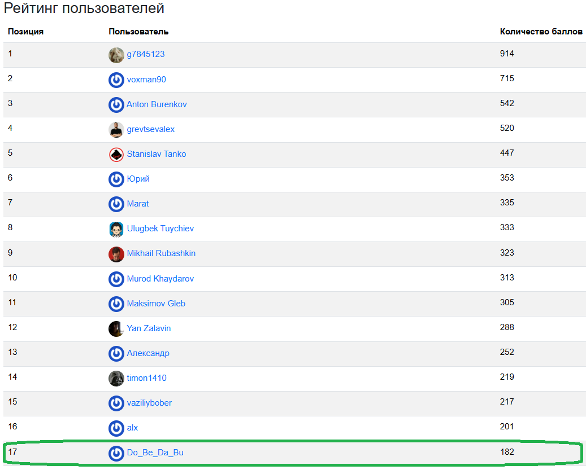

# SICP
Решения задач по курсу Основы компьютерных наук + доп. задачи. Тематика курса построенная по культовой книге computer science сообщества - структура и интерпретация компьютерных программ (SICP).
На момент приостановки прорешивания задач нахожусь на 17 месте, по решению задач:
https://sicp.hexlet.io/ru/ratings/top

* __Tasks from SICP__: Задачи из основной книги
* __Tail recursion__: Построение хвостовой рекурсиии (линейно итеративный процесс)
* __Building functional abstractions__: Построение абстракций, как сложных функций
* __Fold__: Задачи по функции Fold, используемой для агрегирования или свёртки элементов коллекции в одно значение
* __Pairs and lists__: Работа с парами и списками
* __Egyptian multiplication__: Комплекс задач, ведущий к построению метода умножения в древнем Египте (SICP: метод русского крестьянина)
* __Merge sort__: Реализация сортировки слиянием
* __Side effect__: Побочный эффект и присваивание
